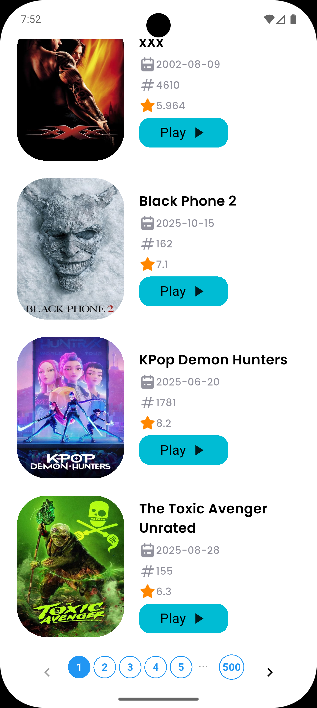
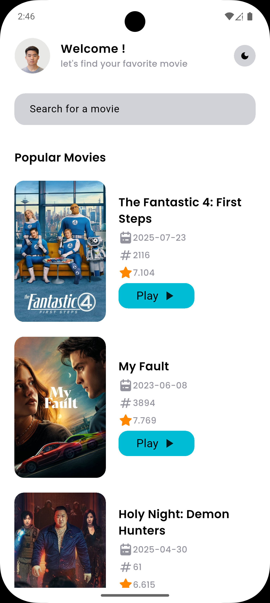
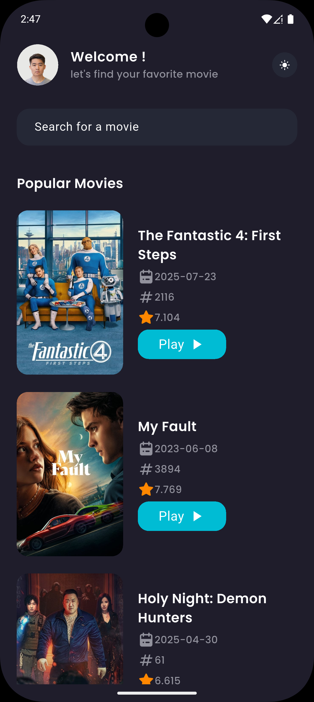
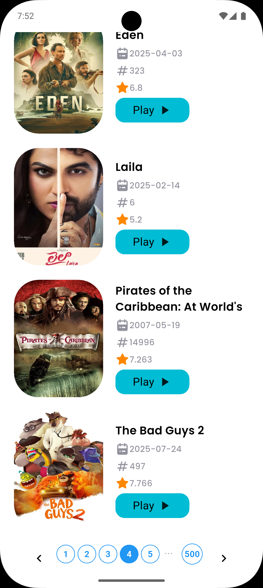
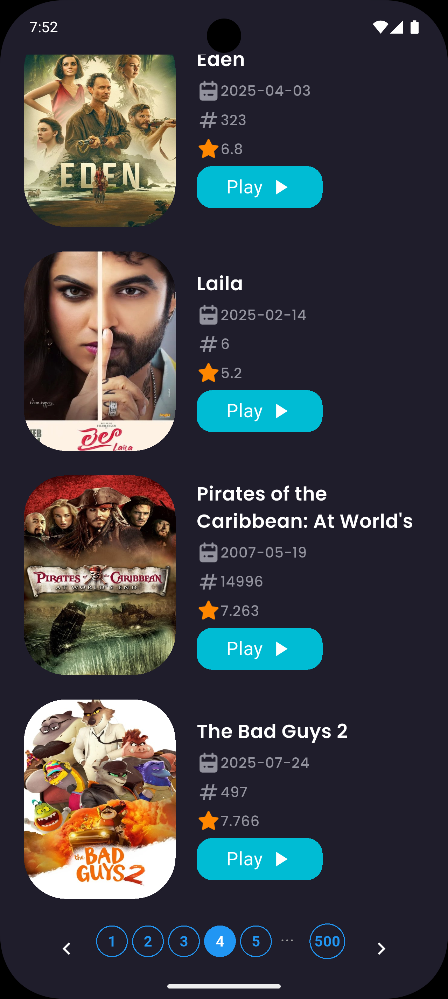
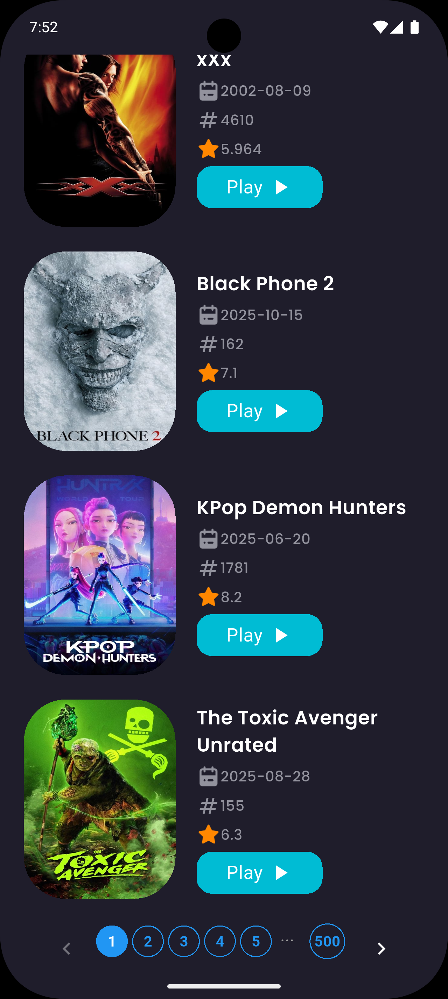
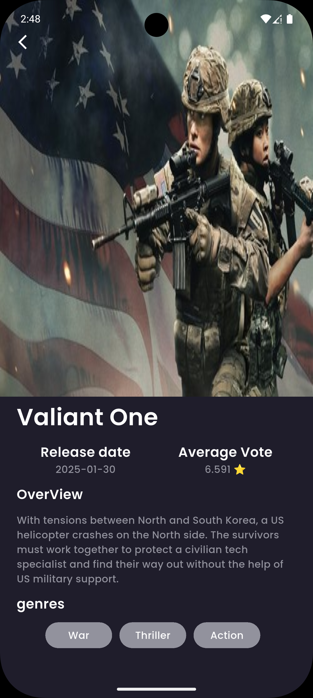

# Movies App

This Flutter application demonstrates a simple movie browsing app with features such as theming, pagination, caching, and error logging.

## Features

1. **Light & Dark Theme**
   - Supports both light and dark modes.
   - Themes are applied globally across the app using `ThemeData`.
   - Users can switch between themes seamlessly.

2. **Pagination**
   - Popular movies are displayed with pagination support.
   - Users can navigate through pages, and only the movies for the selected page are fetched.

3. **Caching with Hive**
   - Movie data is cached locally using Hive.
   - When offline, the app retrieves movies from the cache to ensure a smooth experience.
   - Each page is cached separately, so switching pages offline shows the correct data.

4. **Error Logging with Sentry**
   - Errors are automatically logged to Sentry.
   - Network errors, cache issues, or other runtime exceptions are captured for monitoring.
   - Example: If the app fails to fetch movies due to no internet, the error is sent to Sentry while cached data is shown if available.

